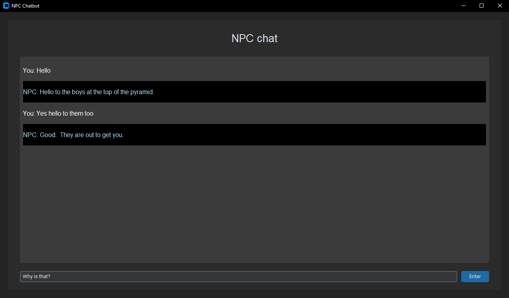

# DialoGPT-StarWars
## Introduction
[ChatbotNPC.py](ChatbotNPC.py) is a chatbot app that can show off any chatbot model trained with [Hugging Face](https://huggingface.co) (or any model if you adjust the [`__init__`](ChatbotNPC.py#L{10}) and [`generate_AI_response`](ChatbotNPC.py#L{107}) functions of the ChatbotApplication class). This application makes use of the [CustomTkinter](https://github.com/TomSchimansky/CustomTkinter) library.

[Chatbot.ipynb](Chatbot.ipynb) is the notebook I used to fine-tune [DialoGPT](https://github.com/microsoft/DialoGPT) (a GPT-2 based chatbot) with data from Star Wars, right now it is set to train a chatbot mimicking Han Solo.

Since it is hard to find good datasets for games, I eventually opted to use the movie scripts from Star Wars episode 4, 5 and 6 which I found on [Kaggle](https://www.kaggle.com/datasets/xvivancos/star-wars-movie-scripts).

This project is meant as an experiment to see if transformers can be used to generate conversations with NPC's in games. Though results of the model I trained were not very promising, I did encounter someone implementing ChatGPT (which is far more advanced, but also far slower and not public) into a mod for the game `Mount & Blade II: Bannerlord`. You can find a link to one of the videos showcasing this mod here: [https://youtu.be/akceKOLtytw](https://youtu.be/akceKOLtytw). This showcases that it is actually possible to feed the information that the AI needs from the fictional world it is in and generate a response with that. The responses in this mod are very slow (on average around 20 seconds) but this also has a lot to do with the API requests that are needed to make use of chatGPT.



## Installation
To run this application, you need to have Python installed with these libraries:
- CustomTkinter
- transformers
- PyTorch

the commands for __CustomTkinter__ and __transformers__ are:
```
pip3 install customtkinter
pip3 install transformers
```
The command for __PyTorch__ can be found on their [site](https://pytorch.org).

You should also have something that can run the application, I personally use [PyCharm](https://www.jetbrains.com/pycharm/).

## How to use
Put your model and tokenizer inside of the [DialoGPT-small-HanSolo](DialoGPT-small-HanSolo) folder (if you adjust the name of the folder, adjust all instances of the folder name in [ChatbotNPC.py](ChatbotNPC.py) as well), there is a link to the model I trained on the Star Wars data inside of the [readme.txt](DialoGPT-small-HanSolo/readme.txt).

Alternatively, you can choose to change the instances of the folder name inside of the [ChatbotNPC.py](ChatbotNPC.py) script to any existing model from Hugging Face, but this will make it so you have to be connected to the internet to use the app.

Now the app should work!

Note: If you use a local model and tokenizer, this app is fully functional without being connected to the internet.
